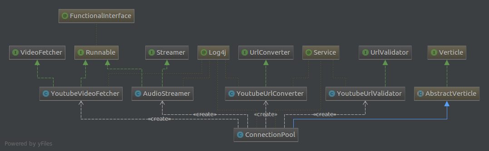

# Youtube Audio Station

[](https://travis-ci.org/OnurKaraduman/audio-station)


This is the project to get audio streaming by youtube video url.

**TODO**
1.Code refactoring
1.Improve unit testing
1.Find the bug related with youtube url converting

### Technology stack
* [Spring Boot](http://projects.spring.io/spring-boot/)
* [Vertx.io](http://vertx.io/)
* [Xuggler](http://www.xuggle.com/xuggler/)
* [Lombok](https://projectlombok.org/)
* [AssertJ](http://joel-costigliola.github.io/assertj/)


### Software Design Overview

 
 The following screenshot shows the structure of flow:
 
 
 
 
### Building

##### Using Maven

````sh
mvn clean install
````

### Running 


##### Using Maven


````sh
mvn spring-boot:run
`````

### Packaging

##### Using Maven

```` sh
mvn package
````